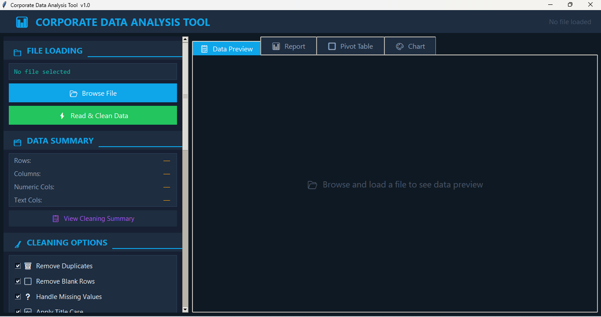
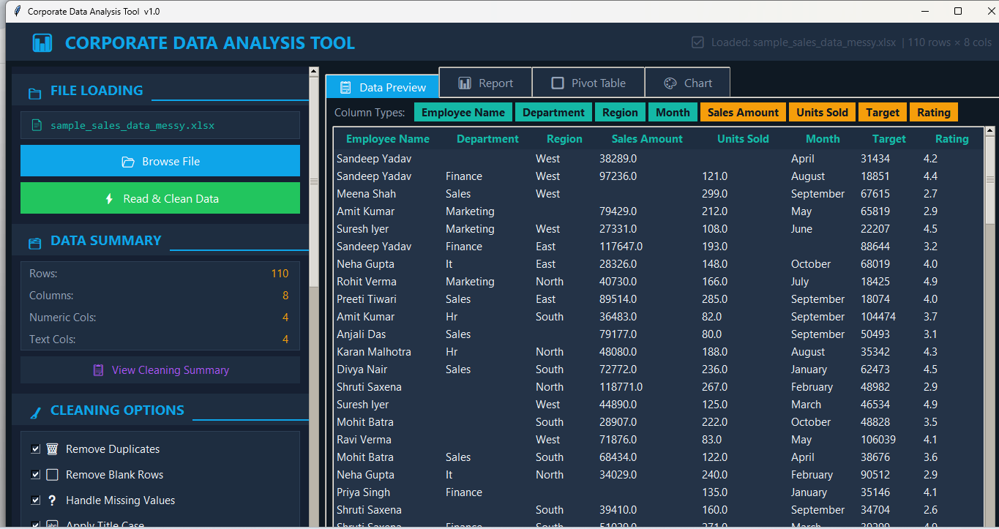
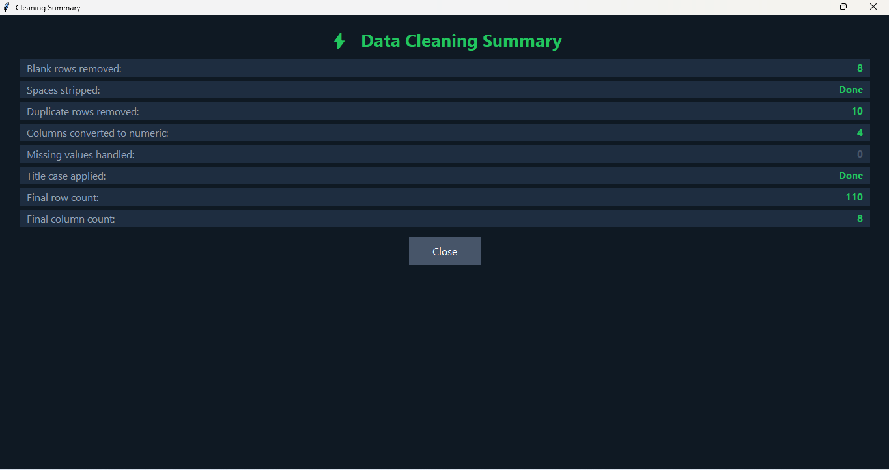
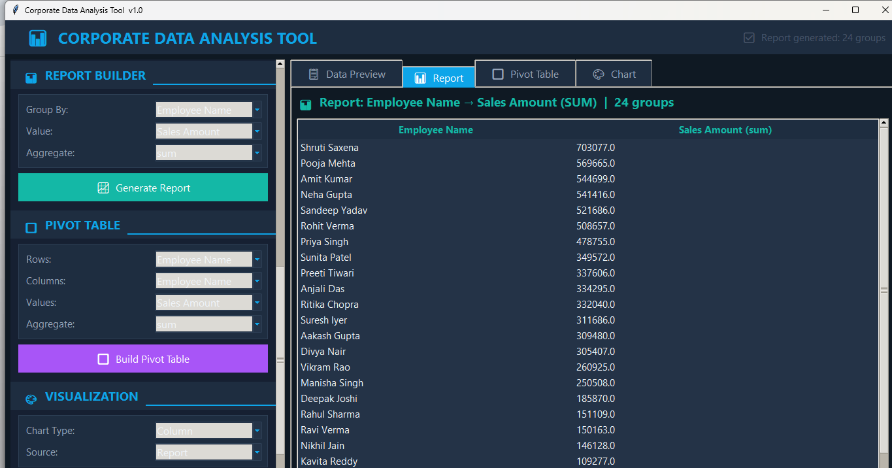
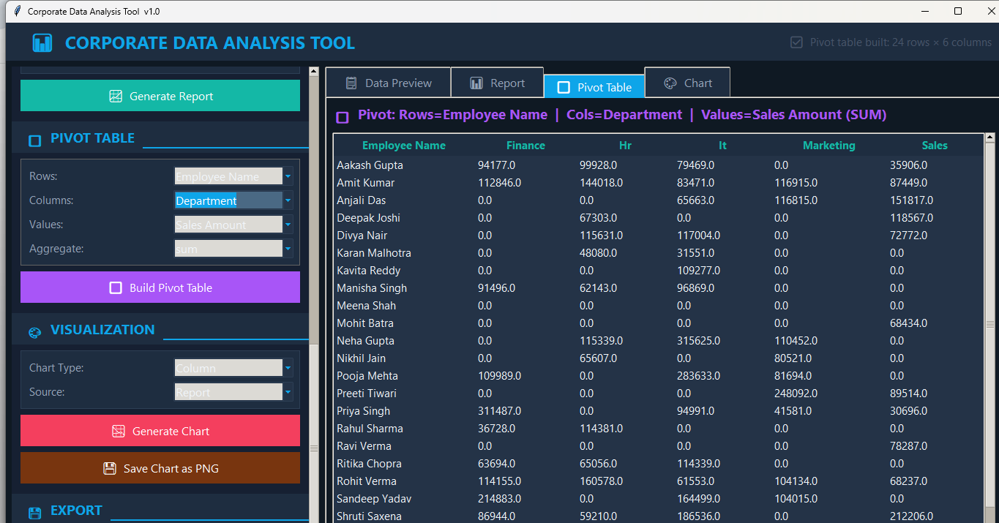
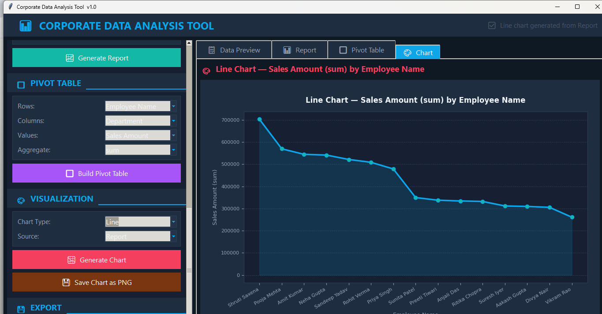

# 📊 Data Analyser Pro

> A professional GUI-based desktop application that allows **non-technical users** to clean, analyse, and visualize Excel/CSV data — **without writing a single line of code.**

---

## 🚀 Overview

**Data Analyser Pro** is a production-ready Python desktop tool built for corporate users who need to perform data analysis quickly and efficiently. No Python knowledge required — just load your file and start analysing!

---

## ✨ Features

### 🧹 Smart Auto Data Cleaning
- ✅ Remove duplicate rows
- ✅ Remove blank rows
- ✅ Handle missing values (median fill for numbers, mode fill for text)
- ✅ Strip leading/trailing spaces
- ✅ Apply Title Case to text columns
- ✅ Convert numeric-like strings to proper numeric format
- ✅ Customizable cleaning options — select only what you need

### 📊 Interactive Report Builder
- Group data by any column
- Choose from 6 aggregations: **Sum, Mean, Count, Max, Min, Median**
- Results sorted descending — instant insights!

### 🔲 Pivot Table Module
- Select Rows, Columns, and Values dynamically
- Multiple aggregation options
- Opens in scrollable popup for large tables

### 🎨 Professional Charts
- **4 Chart Types:** Bar, Column, Line, Pie
- Clean dark corporate theme
- Export charts as **PNG**

### 💾 Export System
- Export reports and pivot tables to **Excel (.xlsx)**
- Export to **CSV**
- Files saved in same folder as source file

### 🖥️ Modern Dark UI
- Corporate dark dashboard design
- Scrollable sidebar
- Color-coded section layout
- User-friendly error messages

---

## 🛠️ Tech Stack

| Technology | Purpose |
|------------|---------|
| Python | Core programming language |
| Tkinter | GUI framework |
| Pandas | Data processing & analysis |
| Matplotlib | Chart generation |
| OpenPyXL | Excel file handling |
| PyInstaller | .exe packaging |

---

## 📂 Supported File Formats

- Microsoft Excel — `.xlsx`, `.xls`
- CSV — `.csv`

---

## ▶️ How to Run

### Option 1 — Run with Python
```bash
# Install dependencies
pip install pandas matplotlib openpyxl

# Run the app
python data_analysis_tool.py
```

### Option 2 — Build .exe (No Python needed)
```bash
pip install pyinstaller
pyinstaller --onefile --windowed --name "DataAnalysisTool" data_analysis_tool.py
```
Find your `.exe` in the `dist/` folder — share it with anyone!

---

## 📸 Screenshots

### Tool Overview


### Data Preview


### Cleaning Summary


### Report Builder


### Pivot Table


### Chart View



---

## 🎯 Why I Built This

Real-world data is always messy. This tool was built to simulate a **corporate data analysis workflow** — helping non-technical teams clean, analyse, and visualize data without relying on developers or learning Python.

---

## 👩‍💻 Built By

**Ishika Verma** — Data Analyst  
🔗 [LinkedIn](https://www.linkedin.com/in/ishika-verma-4b60bb3aa)  
💻 [GitHub](https://github.com)

---

## 🏷️ Tags

`Python` `Data Analysis` `GUI` `Tkinter` `Pandas` `Matplotlib` `Data Cleaning` `Desktop App` `OpenToWork`
